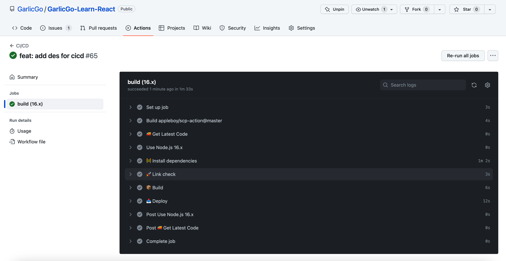

# GarlicGo-Learn-React

English | [简体中文](./README.zh-CN.md)

GarlicGo-Learn-React

Implement CI/CD process based on Github Action. [[ Site URL ](https://learn-react.garlicgo.com/)] [[ Github Repo ](https://github.com/GarlicGo/GarlicGo-Learn-React)]

To Do List

- Add lint-staged optimize the lint check.
- Optimize Webpack config (Mainly for configuration multiplexing).
- Synchronize prettier and eslint configurations.
