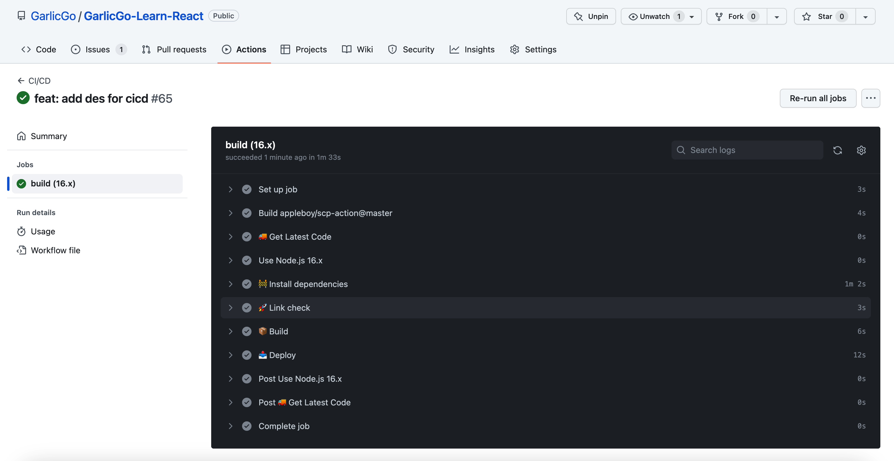

# GarlicGo-Learn-React

简体中文 | [English](./README.md)

GarlicGo 学 React

项目基于 Github Action 完成 CI/CD 流程。[[ 线上入口 ](https://learn-react.garlicgo.com/)] [[ Github 仓库 ](https://github.com/GarlicGo/GarlicGo-Learn-React)]

接下来会做的事

- 添加 lint-staged 对 lint 检查进行优化
- 优化 Webpack 配置（主要针对配置复用）
- 同步 prettier 和 eslint 配置
